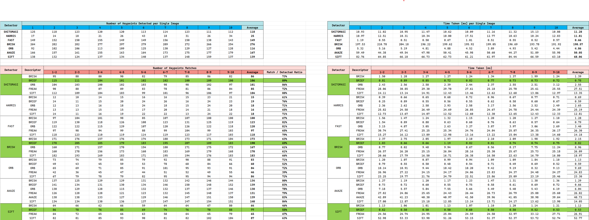

# 2D Feature Tracking

The project involved the development of a feature tracking system as part of a collision detection system, which was structured into four main phases, each focusing on different aspects of feature tracking and optimization.

### Phase 1: Setup and Data Management
- **Achievement:** Established the foundational code structure, including the efficient loading and management of image data.
- **Actions Taken:**
  - Images were loaded into the application.
  - Necessary data structures were set up to hold image data, keypoints, descriptors, etc.
  - A ring buffer mechanism was implemented to manage and optimize memory usage, ensuring that only a limited number of images were kept in memory at any time.

### Phase 2: Keypoint Detection
- **Achievement:** Integrated and evaluated various keypoint detectors to identify points of interest in images.
- **Actions Taken:**
  - Several keypoint detectors, including HARRIS, FAST, BRISK, and SIFT, were integrated.
  - These detectors were compared based on the number of keypoints they identified and their processing speed.
  - The strengths and weaknesses of each detector in different image conditions were analyzed.

### Phase 3: Descriptor Extraction and Matching
- **Achievement:** Extracted descriptors for the identified keypoints and matched them across images using different strategies.
- **Actions Taken:**
  - Descriptor extraction was implemented for the keypoints detected in the previous phase.
  - Two matching techniques were introduced and compared: brute force matching and FLANN (Fast Library for Approximate Nearest Neighbors) based matching.
  - The effectiveness and efficiency of these matching techniques were evaluated.

### Phase 4: Algorithm Testing and Performance Comparison
- **Achievement:** Tested various combinations of keypoint detectors and descriptor matchers to find the most effective setup.
- **Actions Taken:**
  - A framework was created to test different combinations of keypoint detectors and descriptor matchers.
  - The performance of each combination was evaluated based on specific metrics, such as match quality, processing time, and memory usage.
  - The best-performing combinations for different types of images and scenarios were identified.

This approach enabled the development of an efficient and effective feature tracking system, laying the groundwork for the subsequent implementation of a collision detection system.

## Dependencies for Running Locally
* cmake >= 2.8
  * All OSes: [click here for installation instructions](https://cmake.org/install/)
* make >= 4.1 (Linux, Mac), 3.81 (Windows)
  * Linux: make is installed by default on most Linux distros
  * Mac: [install Xcode command line tools to get make](https://developer.apple.com/xcode/features/)
  * Windows: [Click here for installation instructions](http://gnuwin32.sourceforge.net/packages/make.htm)
* OpenCV >= 4.1
  * This must be compiled from source using the `-D OPENCV_ENABLE_NONFREE=ON` cmake flag for testing the SIFT and SURF detectors.
  * The OpenCV 4.1.0 source code can be found [here](https://github.com/opencv/opencv/tree/4.1.0)
* gcc/g++ >= 5.4
  * Linux: gcc / g++ is installed by default on most Linux distros
  * Mac: same deal as make - [install Xcode command line tools](https://developer.apple.com/xcode/features/)
  * Windows: recommend using [MinGW](http://www.mingw.org/)

## Basic Build Instructions

1. Clone this repo.
2. Make a build directory in the top level directory: `mkdir build && cd build`
3. Compile: `cmake .. && make`
4. Run it: `./2D_feature_tracking`.