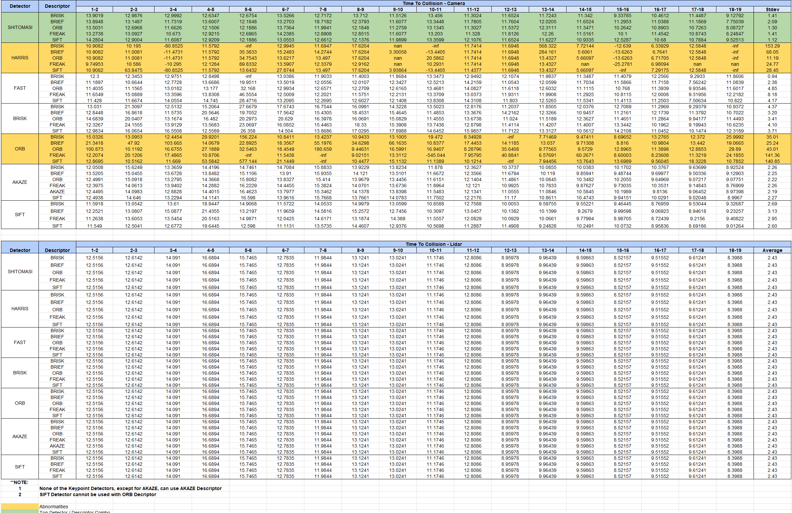

# Camera Sensor Fusion

## FP.1 Match 3D Objects
- **Implementation**: Implemented in `matchBoundingBoxes` within `camFusion_Student.cpp`.

## FP.2 Compute Lidar-based TTC
- **Implementation**: Implemented in `computeTTCLidar` within `camFusion_Student.cpp`.
- **Methodology**: Used the Median Point of the point cloud cluster of the preceding vehicle (for both current and previous frames) rather than the closest point to remove errors introduced by outliers located between the ego car and point cloud cluster.

## FP.3 Associate Keypoint Correspondences with Bounding Boxes
- **Implementation**: Implemented in `clusterKptMatchesWithROI` within `camFusion_Student.cpp`.
- **Approach**: Took the mean of all the Euclidean distances between keypoint matches and then removed those that are too far away from the mean.

## FP.4 Compute Camera-based TTC
- **Implementation**: Implemented in `clusterKptMatchesWithROI` and `computeTTCCamera` within `camFusion_Student.cpp`.
- **Technique**: Used the median distance ratio to compute TTC to remove errors introduced by outliers.

## FP.5 Performance Evaluation 1
- **Observations**: 
  1. Errors observed in Lidar TTC computation. 
     - Example: From Image 1 ans 2, an increase in TTC computed respectively from around 10.88s (camera) and 15.74 (lidar) and 7.49s (camera) to 13s (lidar) due to the use of the median point in the point cloud cluster.

     { width=50% height=50% }
     { width=50% height=50% }

  2. The Broken Velocity Model: 
  The main issue with TTC's inaccuracies stems from its simplistic assumption that both the vehicle and the obstacle (like a preceding vehicle) maintain a constant velocity. This assumption can lead to significant errors in real-world driving scenarios where speed changes are frequent.
  The fundamental flaw in the TTC's velocity model is its inability to accurately handle decelerating obstacles. When a preceding vehicle slows down, the TTC calculations based on constant velocity assumptions become highly inaccurate. This results in either an overestimation or underestimation of the time to collision. This flaw becomes evident in several frames of analysis where the distances between vehicles change due to acceleration or deceleration.
  
  3. Mismatched Distances: 
  In my frame examples, noticing mismatched distances between vehicles, especially in acceleration or deceleration scenarios, highlights the deficiencies of the TTC model. When a vehicle accelerates or decelerates, the TTC calculated at a constant velocity does not reflect the true closing or expanding distance, leading to potentially hazardous misjudgments by the system.

## FP.6 Performance Evaluation 2
- **Reference**: Kindly refer to the spreadsheet “Final Project Spreadsheet”.

## Best Detector + Descriptor Combo - Camera TTC
- **Findings**: 
  - The Shi-Tomasi Detector performed the best due to the lowest standard deviation across TTC calculations.
  - The Shi-Tomasi Detector with the SIFT Descriptor yielded the lowest standard deviation.
  - AKAZE Detector also performed well on average.

## Errors / Abnormal results - Camera TTC
- **Key Points**: 
  - Harris Detector yielded large negative TTCs sometimes due to limited keypoints.
  - ORB Detector yielded several large positive TTCs as well as negative infinity values.

## LiDAR TTC
- **Observation**: LiDAR TTC values were constant regardless of the detector-descriptor combination used.

##

{ width=50% height=50% }
     

## Dependencies for Running Locally
* cmake >= 2.8
  * All OSes: [click here for installation instructions](https://cmake.org/install/)
* make >= 4.1 (Linux, Mac), 3.81 (Windows)
  * Linux: make is installed by default on most Linux distros
  * Mac: [install Xcode command line tools to get make](https://developer.apple.com/xcode/features/)
  * Windows: [Click here for installation instructions](http://gnuwin32.sourceforge.net/packages/make.htm)
* OpenCV >= 4.1
  * This must be compiled from source using the `-D OPENCV_ENABLE_NONFREE=ON` cmake flag for testing the SIFT and SURF detectors.
  * The OpenCV 4.1.0 source code can be found [here](https://github.com/opencv/opencv/tree/4.1.0)
* gcc/g++ >= 5.4
  * Linux: gcc / g++ is installed by default on most Linux distros
  * Mac: same deal as make - [install Xcode command line tools](https://developer.apple.com/xcode/features/)
  * Windows: recommend using [MinGW](http://www.mingw.org/)

## Basic Build Instructions

1. Clone this repo.
2. Make a build directory in the top level project directory: `mkdir build && cd build`
3. Compile: `cmake .. && make`
4. Run it: `./3D_object_tracking`.