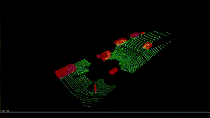

# Lidar Obstacle Detection

The project utilizes **Lidar** technology to capture high-resolution data through the emission of thousands of laser signals. 
These signals, upon reflecting off surfaces, return to the sensor, enabling the calculation of distances based on the time elapsed for the signals' return journey. Moreover, the intensity of the returned signals offers insights into the characteristics of the objects encountered. 
The laser rays, which fall within the infrared spectrum, are emitted across a wide range of angles, typically encompassing a 360-degree field. Despite the unparalleled accuracy of Lidar sensors in generating three-dimensional models of the surrounding environment, their adoption is hindered by a significant cost barrier, with standard units priced upwards of $60,000.

## Project Overview
This project harnesses the power of Lidar Point Cloud technology for the identification of obstacles on roadways. At its core, the project employs the **RANSAC** algorithm to differentiate between the ground and other elements within the 3D dataset. 
Furthermore, the **KD-tree** algorithm is instrumental in clustering point clouds, thereby facilitating the recognition of obstacles within the scene. To enhance the efficiency of obstacle detection, the project incorporates point cloud filtering techniques. 
This involves the downsampling of Lidar data and the exclusion of non-essential regions, thereby focusing on areas within a predefined proximity to the ego vehicle.

## Installation
- sudo apt install libpcl-dev
- cd ~
- git clone https://github.com/PoChang007/Sensor_Fusion_Nanodegree.git
- cd Lidar_Obstacle_Detection
- mkdir build && cd build
- cmake ..
- make
- ./environment

### Linux Ubuntu 16
Install PCL, C++

The link here is very helpful, 
https://larrylisky.com/2014/03/03/installing-pcl-on-ubuntu/

A few updates to the instructions above were needed.

* libvtk needed to be updated to libvtk6-dev instead of (libvtk5-dev). The linker was having trouble locating libvtk5-dev while building, but this might not be a problem for everyone.

* BUILD_visualization needed to be manually turned on, this link shows you how to do that,
http://www.pointclouds.org/documentation/tutorials/building_pcl.php

