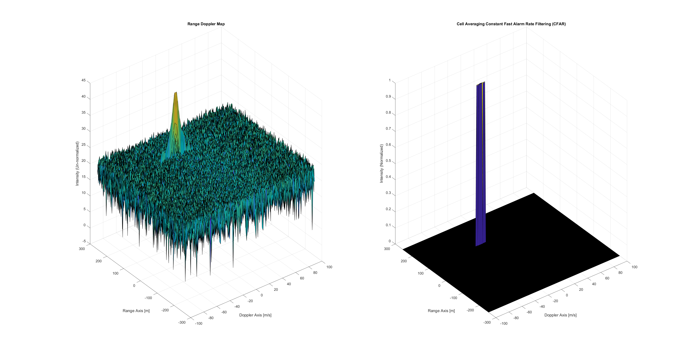

## 2D CFAR Process Implementation Steps

1. **Determine Training and Guard Cells:**
   - Select the number of Training cells for each dimension.
   - Choose the number of Guard cells.

2. **Sliding the Cell Under Test (CUT):**
   - Slide the CUT across the complete matrix.
   - Ensure the CUT has a margin for Training and Guard cells from the edges.

3. **Summing Signal Level in Training Cells:**
   - For each iteration, sum the signal level within all the training cells.
   - Convert values from logarithmic to linear scale using `db2pow` function.

4. **Averaging and Threshold Calculation:**
   - Average the summed values for all the training cells.
   - Convert the average back to logarithmic scale using `pow2db`.
   - Add the offset to determine the threshold.

5. **Comparing Against Threshold:**
   - Compare the signal under CUT against the threshold.
   - If CUT level > threshold, assign it a value of 1.
   - Otherwise, equate it to 0.

6. **Selection of Guard Cells:**
   - Guard cells are selected to be sufficiently large to ensure a clear visible peak.
   - This prevents the peak from being factored into the noise calculations.

7. **Initialization and Storage:**
   - Non-thresholded cells at the edge are initialized as 0 in a separate matrix.
   - Only values exceeding the threshold are stored in this matrix.

 { width=50% height=50% }
